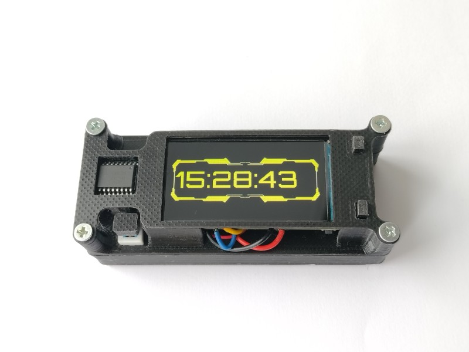

# Cyberpunk watch.

## Features
LILYGO T-Display-S3 based watch.
## Demonstration
[Demo](https://youtu.be/4hzm1pmmMfs)
## Hardware Requirements
- [LILYGO T-Display-S3](https://www.lilygo.cc/products/t-display-s3)
- [DS3231 RTC](https://aliexpress.ru/item/32315883368.html?sku_id=58978523933&spm=a2g2w.stores.seller_list.7.fbcc7a259Fiern)
## Software Requirements
- Arduino IDE 2.3.2
- TFT_eSPI library
- microDS3231 library
## Schematic

## Docs
(Docs/)
## Useful Resources
[T-Display-S3](https://github.com/Xinyuan-LilyGO/T-Display-S3)
[DS3231](https://www.es.co.th/Schemetic/PDF/DS3231.PDF)
[microDS3231_lib](https://github.com/GyverLibs/microDS3231)
[Showing_GIF](https://youtu.be/-h9Vm0Ow_Is?si=F7W1tuOPYlpkoman)
